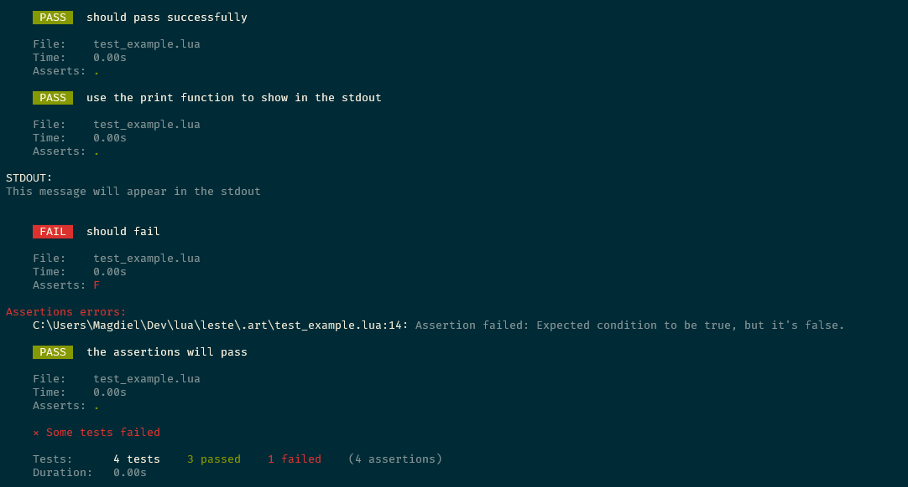

<p align="center">
    
    <p align="center">
        <a href="https://www.lua.org/"></a>
        <a href="./LICENSE"></a>
    </p>
</p>

---

Leste is a powerful and user-friendly Lua testing framework heavily inspired by PestPHP and pytest, aiming to simplify and streamline your testing process.

Just like a compass guides you in the right direction, Leste serves as a guiding tool for your tests, ensuring that you stay on the right path to successful testing practices.

The name Leste cleverly merges Lua (L) and teste (Portuguese for test), embodying the playful essence of its creation. Additionally, the word "leste" in Portuguese carries the meaning of "east". This serving as a subtle homage to Lua's Brazilian roots.

<p align="center">
    
    <br>
    <small>Leste can provide visually appealing error reports to streamline your workflow.</small>
</p>

## Table of Contents

- [Features](#features)
- [Installation](#installation)
  + [Installing Leste with LuaRocks](#installing-leste-with-luarocks)
    + [Ensuring Leste Accessibility](#ensuring-leste-accessibility)
  + [Installing Leste by cloning this repository](#installing-leste-by-cloning-this-repository)
- [Usage](#usage)
  + [Command Syntax](#command-syntax)
  + [Arguments](#arguments)
  + [Options](#options)
  + [Examples](#examples)
- [Writing Tests](#writing-tests)
  + [1. Create a Tests Folder](#1-create-a-tests-folder)
  + [2. Create Test Files](#2-create-test-files)
  + [3. Write Test Cases](#3-write-test-cases)
  + [4. Run Tests](#4-run-tests)
  + [Example Test Execution](#example-test-execution)
- [Contribution](#contribution)
- [License](#license)

## Features

Leste offers the following features:

1. **Assertion Tracking**: Leste tracks the total number of assertions made during tests.
2. **Verbose Output**: Choose whether to display the output of the print function inside tests.
3. **Exit on First Failure**: Option to stop running tests after the first failure.
4. **Test Case Organization**: Easily organize test cases with beforeAll, afterAll, beforeEach, and afterEach hooks.
5. **CLI Interface**: Provides a CLI interface for running tests from the command line.
6. **Flexible Test Case Definition**: Define test cases using the `it` function, specifying a description and test function.
7. **Initialization and Cleanup**: Initializes the testing framework and cleans up after test execution.
8. **Detailed Test Reports**: Generates detailed test reports including test outcomes, execution time, assertions, and errors.
9. **Configurable Output**: Customize the output format based on verbosity settings.
10. **Integration with Lua Modules**: Seamlessly integrate Leste with Lua modules for testing Lua code.

With Leste, you can streamline your testing process and ensure the reliability of your Lua applications.

## Installation

You can install Leste using luarocks or cloning this repository, choose the best option that fits you.

### Installing Leste with LuaRocks

Leste is conveniently available through LuaRocks, the Lua package manager. If you already have LuaRocks installed, you can easily install Leste with the following command:

```bash
luarocks install leste
```

This command will automatically download Leste from the LuaRocks repository and generate the `leste` script for you. This script enables you to run Leste directly from your command line.

#### Ensuring Leste Accessibility

To ensure you can execute Leste from any directory in your terminal, you need to add the LuaRocks bin directory to your system's PATH environment variable. This PATH variable defines the locations your system searches for executable programs.

By default, LuaRocks installs command-line scripts like `leste` in a specific directory depending on your installation type:

- **System-wide Installation:** `/usr/local/bin`
- **Per-user Installation:**
    - `~/.luarocks/bin` (on Unix-like systems)
    - `%APPDATA%/luarocks/bin` (on Windows)

### Installing Leste by cloning this repository

1. Clone the repository from GitHub:
   ```bash
   git clone https://github.com/AdaiasMagdiel/Leste.git
   ```

2. Navigate into the Leste directory:
   ```bash
   cd Leste
   ```

3. Create a script named `leste` (or `leste.bat` for Windows) pointing to the `leste/main.lua` file:
   - For Unix-like systems (Linux, macOS):
     ```bash
     #!/bin/bash

     lua path/to/leste/main.lua $*
     ```
   - For Windows:
     ```cmd
     @echo off

     lua path\to\leste\main.lua %*
     ```

4. Ensure the script is added to your system's PATH so it can be executed from anywhere.

## Usage

Leste provide a CLI interface for running tests using the testing framework.

### Command Syntax

```bash
leste [options] [file/folder...]
```

### Arguments

- `file`: File (or files) with tests to run.
- `folder`: Folder (or folders) to find tests, default is `./tests`.

### Options

- `-d, --disable-color`: Disable color for the output, print raw text. Default is `false`.
- `-h, --help`: Show the usage message and exit.
- `-v, --verbose`: Display output of print function inside tests. Default is `false`.
- `-x, --exitfirst`: Exit on the first failure. Default is `false`.

### Examples

Run tests located in the default `./tests` folder with verbose output:

```bash
leste -v
```

Run tests located in a specific folder:

```bash
leste my_tests_folder
```

Stop the tests after the first failure:

```bash
leste -x
```

To disable colors in the output, use the `-d` or `--disable-color` flags.

```bash
leste -d
```

## Writing Tests

### 1. Create a Tests Folder

First, create a folder named `tests` in your project directory. This folder will contain all your test files.

```bash
mkdir tests
```

### 2. Create Test Files

Inside the `tests` folder, create a Lua file for each set of tests you want to write. Ensure that each test file has a filename prefix of "test" so that Leste can discover and execute them. For example, `testExample.lua`.

### 3. Write Test Cases

In each test file, you can define multiple test cases using the `Leste.it` function. Each test case consists of a description and a function containing the test assertions.

Here's an example of a valid test file (`testExample.lua`):

```lua
local Leste = require("leste.leste")

-- Test case 1: A basic example
Leste.it("Remember to write an interesting and well-explained description about the test.", function()
    assert(true)
end)

-- Test case 2: Using print statements for debugging
Leste.it("You can add print statements if you need to debug, but remember to use the -v flag.", function()
    print("This message will appear in the test standard output.")
    assert(true)
end)
```

> [!TIP]
> Utilizing Lua's `assert` function is an effective method for asserting your tests. For more detailed output, consider utilizing the `leste.assertions` module. This module offers a range of assert functions that are adept at handling errors more efficiently.

### 4. Run Tests

To execute the tests, use the Leste CLI interface. Navigate to your project directory in the terminal and run the following command:

```bash
leste -v
```

This command will automatically run all the test files (`test*`) located in the `tests` folder. You can also specify a specific folder to run tests from if needed.

Try to run the code without the verbose flag to observe how the print function is silenced.

```bash
leste
```

### Example Test Execution

After running the tests, you will see the test results displayed in the terminal, including passed and failed tests, execution time, and any assertions errors, general errors or debug output.

```bash
    PASS   Remember to write an interesting and well-explained description about the test.

    File:    testExample.lua
    Time:    0.00s
    Asserts: .

    PASS   You can add print statements if you need to debug, but remember to use the -v flag.

    File:    testExample.lua
    Time:    0.00s
    Asserts: .

STDOUT:
This message will appear in the test standard output. 


    ✓ All tests passed successfully

    Tests:      2 tests    2 passed    0 failed    (2 assertions)
    Duration:   0.00s
```

## Contribution

Contributions are welcome Please feel free to submit pull requests or open issues for any bugs or feature requests.

You can start selecting a task from the list in the [TODO.md](TODO.md) file.

## License

This project is licensed under the MIT License. See the [LICENSE](LICENSE) file for details.
